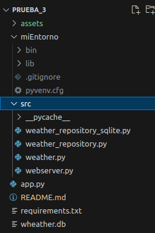
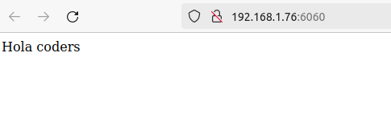
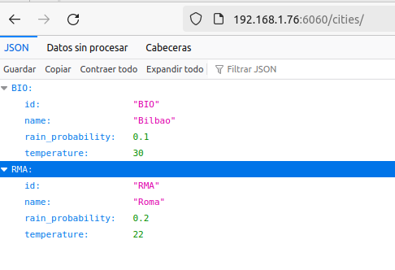
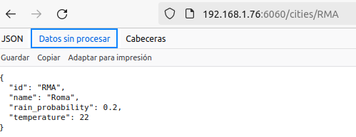

# Objetivos del proyecto
####  Mostrar como es una arquitectura de directorios con una distribucion entre un entorno virtual, una carpeta src, de archivos fuente y un archivo .py donde se inicia la aplicacion

####  Mostrar un archivo app.py con las funciones routes, que crean los endpoints y reciben las peticiones http
####  Mostrar como se han dividido en capas de archivos comunicados las distintas funcionalidades 
- 1 Recepcion de las peticiones
- 2 Funciones intermedias, donde se pueden implementar distintos scripts de la logica de negocio
- 3 Conexion con el elemento que garantiza la persistencia de datos, sea un objeto JSON, o mas propiamente dicho una Base de Datos
   La existencia de diversos archivos de conexion permite que esta pueda ser facilmente intercambiable entre un archivo final de funciones
   que haga un CRUD, con sistemas de BBDD, en SqLite, MySql, MongoDB

#### Permitir utilizar una herramienta que permita testar las distintas peticiones para comprobar asi su fucionamiento y su eficacia de planificacion
 Comprobar a traves de Postman las peticiones que se hacen, añadiendo al body de la request los elementos propios de un POST o de un PUT

# Requisitos de instalacion y puesta en marcha
Una vez hecho git clone, es posible que en el equipo de destino sea necesario instalar el paquete de flask_cors, para que las importaciones de este proyecto se puedan utilizar en una maquina que ya lo tenga instalado

Para poder arrancar el servidor de desarrollo

python3.10 app.py

## Gestion de las peticiones http

Peticion por GET recogiendo la respuesta del directorio raiz

---

Peticion por GET recogiendo todos los valores

---

Peticion por GET recogiendo el valor de un elemento, a traves de un id

---

## Datos para cargar las dependencias en el txt de requirements
pip install -r requiremnts.txt
python3 app.py

run server